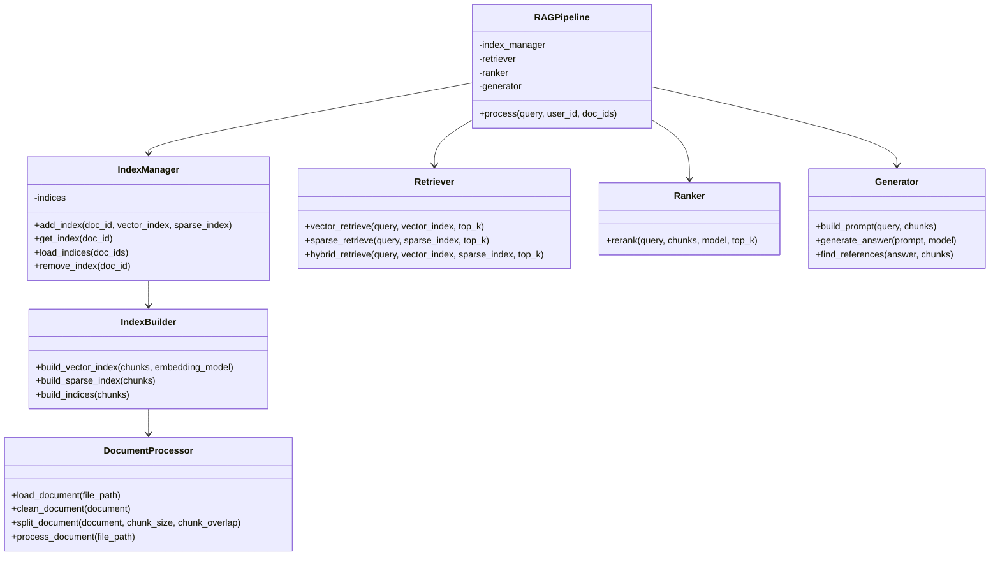
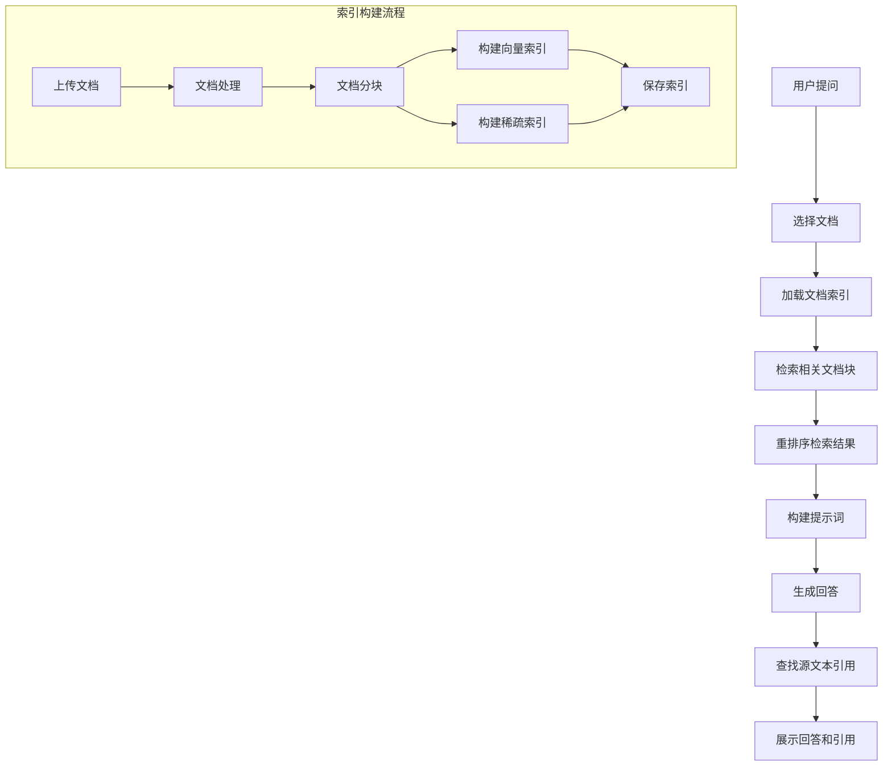

# 多文档问答系统

## 项目概述

多文档问答系统是在现有单文档问答系统基础上的扩展，支持对多篇文章进行统一检索和智能问答。系统采用模块化设计，每个模块可独立替换和优化，确保系统的灵活性和可扩展性。

## 项目结构

```
/
├── app.py                  # 主入口文件
├── pages/                  # Streamlit多页面
│   ├── 00_登录注册.py      # 用户登录注册页面
│   ├── 01_上传文档.py      # PDF上传和处理页面
│   ├── 02_构建索引.py      # 查看文档和构建索引页面  
│   ├── 03_论文问答.py      # 问答页面
│   ├── 04_管理中心.py      # 管理员管理中心页面
│   └── 05_多文档问答.py    # 【新增】多文档问答页面
├── src/                    # 核心代码
│   ├── auth.py             # 用户认证和管理
│   ├── admin.py            # 管理员功能
│   ├── pdf_processor.py    # PDF处理相关功能
│   ├── build_index.py      # 索引构建功能
│   ├── retriever.py        # 检索和问答功能
│   ├── utils.py            # 工具函数
│   └── multi_docs/         # 【新增】多文档问答模块
│       ├── __init__.py
│       ├── document_processor/  # 文档处理模块
│       │   ├── __init__.py
│       │   ├── loader.py        # 文档加载器
│       │   ├── cleaner.py       # 文档清洗器
│       │   └── splitter.py      # 文档分块器
│       ├── indexer/            # 索引构建模块
│       │   ├── __init__.py
│       │   ├── vector_indexer.py  # 向量索引构建器
│       │   ├── sparse_indexer.py  # 稀疏索引构建器
│       │   └── index_manager.py   # 索引管理器
│       ├── retriever/          # 检索模块
│       │   ├── __init__.py
│       │   ├── vector_retriever.py # 向量检索器
│       │   ├── sparse_retriever.py # 稀疏检索器
│       │   └── hybrid_retriever.py # 混合检索器
│       ├── ranker/             # 排序模块
│       │   ├── __init__.py
│       │   ├── base_ranker.py    # 基础排序器
│       │   └── reranker.py       # 重排器
│       ├── generator/          # 生成模块
│       │   ├── __init__.py
│       │   ├── prompt_builder.py # 提示词构建器
│       │   └── llm_generator.py  # 大模型生成器
│       └── pipeline/           # 流水线模块
│           ├── __init__.py
│           ├── rag_pipeline.py   # RAG流水线
│           └── config.py         # 配置管理
├── data/                   # 存储上传的PDF文件
├── output/                 # 存储处理后的PDF输出
├── storage/                # 存储索引文件
│   └── multi_docs/         # 【新增】多文档索引存储
│       ├── global_index/   # 全局索引映射
│       └── doc_indices/    # 文档索引存储
├── db/                     # 数据库文件
├── config/                 # 系统配置目录
│   └── multi_docs_config.yaml # 【新增】多文档配置文件
└── requirements.txt        # 依赖库列表
```

## 功能概述

1. **多文档管理**：支持多篇文档的上传、处理和索引构建
2. **跨文档检索**：支持在多篇文档中进行统一检索
3. **智能排序**：对检索结果进行智能排序和筛选
4. **上下文生成**：基于检索结果生成高质量回答
5. **源文本引用**：提供回答的源文本引用和追踪

## 技术架构

系统采用模块化设计，主要包括以下核心模块：

1. **文档处理模块**：负责文档读取、清洗和分块
2. **索引构建模块**：负责为文档构建检索索引
3. **检索模块**：负责从索引中检索相关文档片段
4. **排序模块**：负责对检索结果进行排序和筛选
5. **生成模块**：负责基于检索结果生成回答
6. **流水线模块**：负责组织和协调各个模块的工作

## 实施计划

### 阶段一：基础架构搭建

- [x] 创建项目规划和README.md
- [ ] 创建多文档问答模块目录结构
  - [ ] 创建主目录和子目录
  - [ ] 设置基础配置文件
- [ ] 实现文档处理模块
  - [ ] 实现文档加载器
  ```python
  def load_documents(file_paths):
      """加载多个文档"""
      documents = []
      for file_path in file_paths:
          document = load_document(file_path)
          documents.append(document)
      return documents
  ```
  - [ ] 实现文档清洗器
  ```python
  def clean_document(document):
      """清洗文档内容"""
      # 移除特殊字符、格式化文本等
      cleaned_content = remove_special_chars(document.content)
      document.content = cleaned_content
      return document
  ```
  - [ ] 实现文档分块器
  ```python
  def split_document(document, chunk_size=1024, chunk_overlap=200):
      """将文档分割成块"""
      chunks = []
      # 使用滑动窗口分割文本
      for i in range(0, len(document.content), chunk_size - chunk_overlap):
          chunk = document.content[i:i + chunk_size]
          chunks.append(chunk)
      return chunks
  ```

### 阶段二：索引构建模块开发

- [ ] 实现向量索引构建器
  ```python
  def build_vector_index(chunks, embedding_model):
      """构建向量索引"""
      embeddings = []
      for chunk in chunks:
          embedding = embedding_model.embed_text(chunk)
          embeddings.append(embedding)
      return VectorIndex(chunks, embeddings)
  ```
- [ ] 实现稀疏索引构建器
  ```python
  def build_sparse_index(chunks):
      """构建稀疏索引（BM25）"""
      tokenized_chunks = [tokenize(chunk) for chunk in chunks]
      bm25_index = BM25Index(tokenized_chunks)
      return bm25_index
  ```
- [ ] 实现索引管理器
  ```python
  class IndexManager:
      def __init__(self, storage_path):
          self.storage_path = storage_path
          self.indices = {}
          
      def add_index(self, doc_id, vector_index, sparse_index):
          """添加文档索引"""
          self.indices[doc_id] = {
              "vector_index": vector_index,
              "sparse_index": sparse_index
          }
          self._save_index(doc_id)
          
      def load_indices(self, doc_ids):
          """加载多个文档的索引"""
          loaded_indices = {}
          for doc_id in doc_ids:
              if doc_id not in self.indices:
                  self._load_index(doc_id)
              loaded_indices[doc_id] = self.indices[doc_id]
          return loaded_indices
  ```

### 阶段三：检索和排序模块开发

- [ ] 实现向量检索器
  ```python
  def vector_retrieve(query, vector_index, top_k=10):
      """向量检索相关文档块"""
      query_embedding = embed_text(query)
      scores = compute_similarity(query_embedding, vector_index.embeddings)
      top_indices = get_top_k_indices(scores, top_k)
      return [vector_index.chunks[i] for i in top_indices]
  ```
- [ ] 实现稀疏检索器
  ```python
  def sparse_retrieve(query, sparse_index, top_k=10):
      """稀疏检索相关文档块"""
      query_tokens = tokenize(query)
      scores = sparse_index.get_scores(query_tokens)
      top_indices = get_top_k_indices(scores, top_k)
      return [sparse_index.chunks[i] for i in top_indices]
  ```
- [ ] 实现混合检索器
  ```python
  def hybrid_retrieve(query, vector_index, sparse_index, top_k=10):
      """混合检索策略"""
      vector_results = vector_retrieve(query, vector_index, top_k)
      sparse_results = sparse_retrieve(query, sparse_index, top_k)
      merged_results = merge_results(vector_results, sparse_results)
      return merged_results[:top_k]
  ```
- [ ] 实现重排器
  ```python
  def rerank(query, chunks, model, top_k=5):
      """重排检索结果"""
      inputs = prepare_rerank_inputs(query, chunks)
      scores = model.predict(inputs)
      reranked_chunks = [chunk for _, chunk in sorted(
          zip(scores, chunks), key=lambda x: x[0], reverse=True
      )]
      return reranked_chunks[:top_k]
  ```

### 阶段四：生成模块开发

- [ ] 实现提示词构建器
  ```python
  def build_prompt(query, chunks):
      """构建提示词"""
      context = "\n\n".join([f"文档{i+1}: {chunk}" for i, chunk in enumerate(chunks)])
      prompt = f"""上下文信息如下：
      ----------
      {context}
      ----------
      请基于上下文信息而不是自己的知识，回答以下问题，如果上下文信息没有相关知识，可以回答不确定：
      {query}
      """
      return prompt
  ```
- [ ] 实现大模型生成器
  ```python
  def generate_answer(prompt, model):
      """生成回答"""
      response = model.generate(prompt)
      return response.text
  ```
- [ ] 实现源文本引用
  ```python
  def find_references(answer, chunks):
      """查找回答中的源文本引用"""
      references = []
      for chunk in chunks:
          if has_overlap(answer, chunk):
              references.append(chunk)
      return references
  ```

### 阶段五：流水线模块开发

- [ ] 实现配置管理
  ```python
  def load_config(config_path):
      """加载配置文件"""
      with open(config_path, 'r') as f:
          config = yaml.safe_load(f)
      return config
  ```
- [ ] 实现RAG流水线
  ```python
  class RAGPipeline:
      def __init__(self, config):
          self.config = config
          self.index_manager = IndexManager(config["storage_path"])
          # 初始化其他组件
          
      def process(self, query, doc_ids):
          """处理查询"""
          # 1. 加载索引
          indices = self.index_manager.load_indices(doc_ids)
          
          # 2. 检索相关文档块
          chunks = []
          for doc_id, index in indices.items():
              doc_chunks = hybrid_retrieve(
                  query, 
                  index["vector_index"], 
                  index["sparse_index"],
                  self.config["retrieve_top_k"]
              )
              chunks.extend(doc_chunks)
          
          # 3. 重排序
          reranked_chunks = rerank(
              query, 
              chunks, 
              self.reranker,
              self.config["rerank_top_k"]
          )
          
          # 4. 构建提示词
          prompt = build_prompt(query, reranked_chunks)
          
          # 5. 生成回答
          answer = generate_answer(prompt, self.llm)
          
          # 6. 查找引用
          references = find_references(answer, reranked_chunks)
          
          return {
              "answer": answer,
              "references": references,
              "chunks": reranked_chunks
          }
  ```

### 阶段六：UI开发和系统集成

- [ ] 创建多文档问答页面
  ```python
  # pages/05_多文档问答.py
  import streamlit as st
  from src.multi_docs.pipeline import RAGPipeline
  from src.utils import get_user_documents
  
  # 页面设置
  st.set_page_config(page_title="多文档问答", page_icon="📚", layout="wide")
  
  # 检查登录状态
  if "user_id" not in st.session_state:
      st.error("请先登录")
      st.stop()
      
  # 初始化RAG流水线
  if "multi_doc_pipeline" not in st.session_state:
      config = load_config("config/multi_docs_config.yaml")
      st.session_state.multi_doc_pipeline = RAGPipeline(config)
  
  # 获取用户文档
  user_docs = get_user_documents(st.session_state.user_id)
  indexed_docs = [doc for doc in user_docs if is_document_indexed(st.session_state.user_id, doc["doc_id"])]
  
  # 文档选择
  selected_docs = st.multiselect(
      "选择要问答的文档",
      options=[doc["filename"] for doc in indexed_docs],
      default=[]
  )
  
  # 获取选中文档的ID
  selected_doc_ids = [
      doc["doc_id"] for doc in indexed_docs 
      if doc["filename"] in selected_docs
  ]
  
  # 问答界面
  if selected_doc_ids:
      query = st.text_input("请输入您的问题")
      if query:
          with st.spinner("正在思考..."):
              result = st.session_state.multi_doc_pipeline.process(
                  query, 
                  st.session_state.user_id, 
                  selected_doc_ids
              )
              
          st.write("### 回答")
          st.write(result["answer"])
          
          with st.expander("查看引用"):
              for i, ref in enumerate(result["references"]):
                  st.write(f"**引用 {i+1}**:")
                  st.write(ref)
  else:
      st.info("请选择至少一个文档进行问答")
  ```
- [ ] 集成到现有系统
  - [ ] 更新导航菜单
  - [ ] 添加多文档问答入口
  - [ ] 共享用户认证和数据存储

## 多文档索引存储结构

多文档索引采用分层存储结构，确保高效的检索和管理：

```
storage/
  multi_docs/
    global_index/
      metadata.json         # 全局元数据
      doc_mapping.json      # 文档映射表
    doc_indices/
      {user_id}/
        {doc_id_1}/
          vector_index/     # 向量索引
          sparse_index/     # 稀疏索引
          metadata.json     # 文档元数据
        {doc_id_2}/
          ...
```

## 配置文件示例

```yaml
# config/multi_docs_config.yaml

# 文档处理配置
document_processor:
  chunk_size: 1024
  chunk_overlap: 200
  split_method: "sentence"  # sentence, paragraph, fixed

# 索引配置
indexer:
  vector_model: "text-embedding-v3"
  sparse_type: "bm25"  # bm25, tf-idf
  use_hybrid: true

# 检索配置
retriever:
  retrieve_top_k: 10
  fusion_strategy: "rrf"  # rrf, simple_merge

# 排序配置
ranker:
  reranker_model: "bge-reranker-v2"
  rerank_top_k: 5

# 生成配置
generator:
  llm_model: "gpt-4.1-mini"
  max_tokens: 1024
  temperature: 0.7
  system_prompt: "你是基于检索增强生成的AI助手，回答用户问题时基于提供的文档内容。如果问题与上下文文档无关，请明确指出。"

# 系统配置
system:
  storage_path: "storage/multi_docs"
  cache_size: 10  # 缓存的文档数量
```

## 核心类图



## 流程图



## 使用方法

### 1. 索引构建

```python
from src.multi_docs.document_processor import DocumentProcessor
from src.multi_docs.indexer import IndexBuilder, IndexManager

# 初始化组件
processor = DocumentProcessor(config)
builder = IndexBuilder(config)
manager = IndexManager(config["storage_path"])

# 处理文档
document = processor.load_document("path/to/document.pdf")
clean_document = processor.clean_document(document)
chunks = processor.split_document(clean_document)

# 构建索引
vector_index, sparse_index = builder.build_indices(chunks)

# 保存索引
manager.add_index("doc_123", vector_index, sparse_index)
```

### 2. 多文档检索和问答

```python
from src.multi_docs.pipeline import RAGPipeline

# 初始化RAG流水线
pipeline = RAGPipeline(config)

# 处理查询
result = pipeline.process(
    "什么是强化学习?",
    user_id="user_123",
    doc_ids=["doc_1", "doc_2", "doc_3"]
)

# 获取结果
answer = result["answer"]
references = result["references"]
```

## 开发注意事项

1. **模块化设计**：
   - 每个模块应该有明确的接口和职责
   - 确保模块之间的低耦合性，便于替换和升级

2. **性能优化**：
   - 对大型文档集合，考虑使用异步处理
   - 实现索引缓存机制，减少重复加载
   - 考虑使用批处理提高检索效率

3. **用户体验**：
   - 提供进度反馈，特别是在索引构建和检索过程中
   - 支持流式输出回答，提高响应速度
   - 提供清晰的源文本引用，增强可信度

4. **错误处理**：
   - 实现健壮的错误处理机制
   - 提供友好的错误提示
   - 支持自动重试和恢复

## 测试计划

1. **单元测试**：
   - 测试各个模块的核心功能
   - 验证接口一致性

2. **集成测试**：
   - 测试模块间的交互
   - 验证流水线的端到端功能

3. **性能测试**：
   - 测试大规模文档集的索引构建性能
   - 测试多文档检索的响应时间

4. **用户测试**：
   - 收集用户反馈
   - 优化用户界面和交互体验

## 扩展计划

1. **支持更多文档格式**：
   - Word文档
   - HTML网页
   - 表格数据

2. **高级检索功能**：
   - 语义过滤
   - 元数据搜索
   - 时间范围筛选

3. **个性化配置**：
   - 用户偏好设置
   - 检索策略自定义
   - 回答风格调整

4. **多语言支持**：
   - 扩展到其他语言的文档处理
   - 多语言问答支持

## 参考资源

- [LlamaIndex文档](https://docs.llamaindex.ai/)
- [Sentence Transformers](https://www.sbert.net/)
- [BM25算法介绍](https://en.wikipedia.org/wiki/Okapi_BM25)
- [RAG最佳实践](https://www.pinecone.io/learn/retrieval-augmented-generation/) 